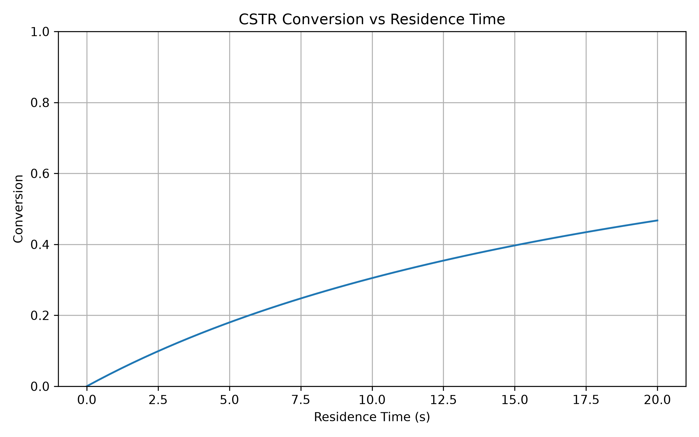
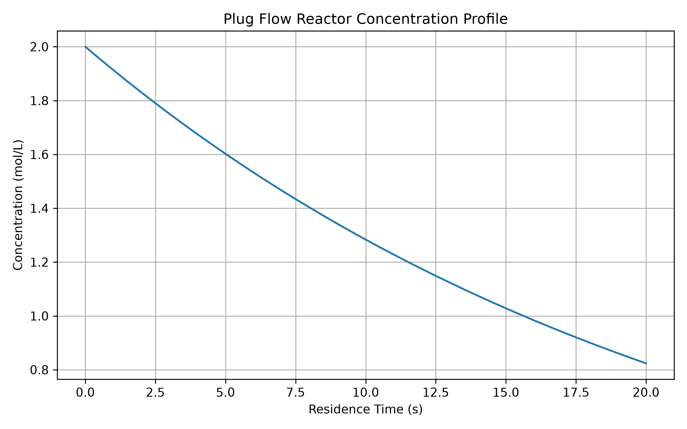
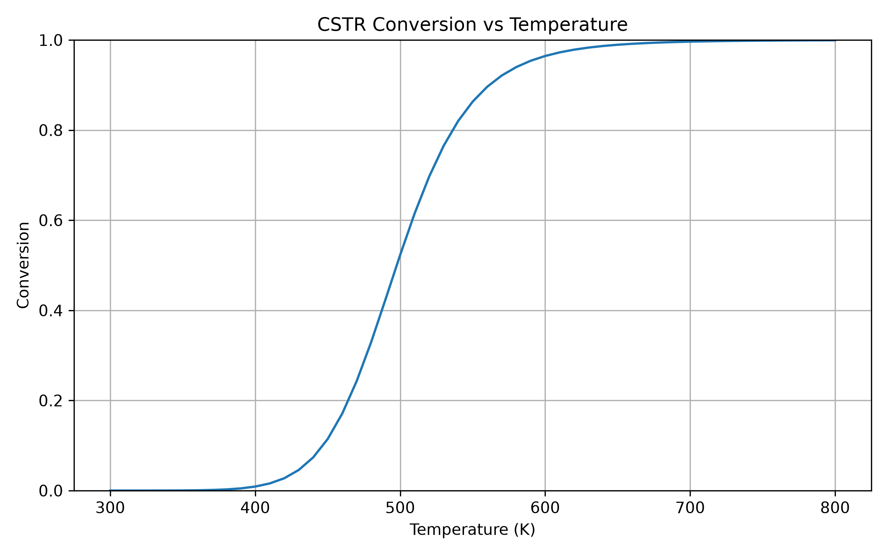

# Chemical Reactor Simulator

A Python project for learning chemical reaction engineering through numerical simulation.

The project provides numerical tools to study Arrhenius kinetics, reaction rate laws, and ideal reactor models, including Batch Reactors, Continuous Stirred-Tank Reactors (CSTR), and Plug Flow Reactors (PFR). It is designed as a learning project for chemical engineering students and will continue to expand with more advanced reactor models and process simulation features.

## Current Features

- Calculate Arrhenius rate constants
- Support zero-, first-, and second-order reactions
- Batch reactor simulation
- Continuous Stirred-Tank Reactor (CSTR) simulation
- Plug Flow Reactor (PFR) simulation
- Temperature sweep analysis
- Generate publication-quality plots
- Modular project structure

## Equation

The Arrhenius equation is:

k = A exp(-Ea / RT)

where:

- k is the reaction rate constant
- A is the pre-exponential factor
- Ea is the activation energy
- R is the gas constant
- T is the absolute temperature

Reaction rate equations

Zero-order:

r = k

First-order:

r = kC

Second-order:

r = kC²

## Results

### Arrhenius Plot


---

### Batch Reactor


---

### CSTR



---

### Plug Flow Reactor (PFR)



---

### Temperature Sweep



## Installation

Clone the repository:

```bash
git clone https://github.com/ni0915ni/chemical-reactor-simulator.git
cd chemical-reactor-simulator
```

Create and activate a virtual environment:

```bash
python3 -m venv .venv
source .venv/bin/activate
```

Install the required package:

```bash
python -m pip install -r requirements.txt
```

## Usage

R## Usage

Run the interactive simulator:

```bash
python src/main.py
```

Available simulation modes:

    - Batch Reactor
    - CSTR
    - PFR
    - Temperature Sweep

## Example

### Menu

```text
1. Batch
2. CSTR
3. Plug Flow Reactor
4. Temperature Sweep
```

### Example Input

```text
Temperature = 500 K
Initial concentration = 4 mol/L
Reaction order = 1

Residence time = 20 s
```

### Example Output

```text
Outlet concentration = 1.647 mol/L
Conversion = 58.8%
```

## Project Structure

```text
chemical-reactor-simulator/
├── figures/
│   ├── arrhenius_plot.png          # Arrhenius equation plot
│   └── batch_reactor_plot.png      # Batch reactor concentration profile
│   ├── cstr_conversion_plot.png
│   ├── pfr_concentration_profile.png
│   └── temperature_sweep.png
│
├── src/
│   ├── kinetics.py                 # Reaction kinetics calculations
│   ├── reactors.py                 # Reactor simulation models
│   ├── plotting.py                 # Plotting utilities
│   ├── plot_arrhenius.py           # Generate Arrhenius plot
│   ├── plot_batch.py               # Generate batch reactor plot
│   ├── temperature_sweep.py 
│   └── main.py                     # Main interactive simulator
│
├── .gitignore
├── README.md
└── requirements.txt
```

## Future Work

- Experimental data validation
- Parameter estimation
- Non-isothermal reactor simulation
- Multiple reactions
- Reactor comparison dashboard
- Process optimization
- CSV export
- Graphical User Interface (GUI)