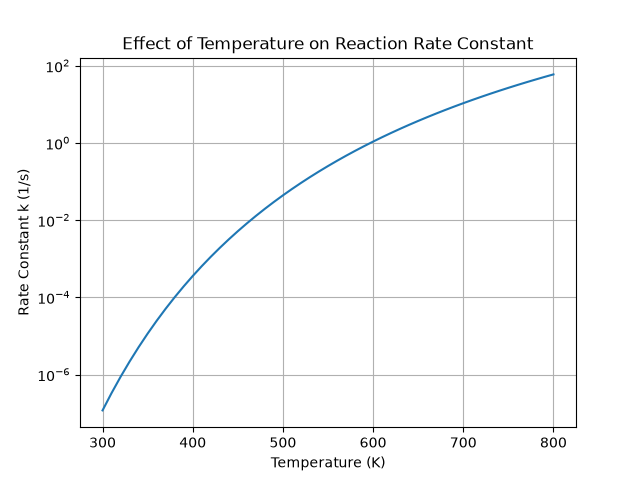
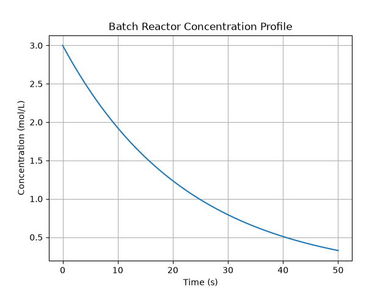

# Chemical Reactor Simulator

A Python project for learning chemical reaction engineering through numerical simulation.

The project provides numerical tools to study Arrhenius kinetics, reaction rate laws, and batch reactor behavior. It is intended as a learning project for chemical engineering students and will be extended to include CSTR and plug flow reactor simulations.

## Current Features

- Calculate reaction rate constants using the Arrhenius equation
- Support zero-, first-, and second-order reaction kinetics
- Simulate concentration changes in a batch reactor
- Plot Arrhenius equation
- Plot batch reactor concentration profile
- Temperature sweep (300–800 K)
- Interactive command-line interface

## Equation

The Arrhenius equation is:

k = A exp(-Ea / RT)

where:

- k is the reaction rate constant
- A is the pre-exponential factor
- Ea is the activation energy
- R is the gas constant
- T is the absolute temperature

Reaction rate equations

Zero-order:

r = k

First-order:

r = kC

Second-order:

r = kC²

## Files

```
src/
    main.py
    plot_arrhenius.py

figures/
    arrhenius_plot.png
```

## Results

### Arrhenius Plot



### Batch Reactor Concentration Profile



The figures below illustrate the simulation results generated by the program.

The Arrhenius plot shows the exponential dependence of the reaction rate constant on temperature.

The batch reactor profile demonstrates the decrease in reactant concentration over time for a first-order reaction.

## Installation

Clone the repository:

```bash
git clone https://github.com/ni0915ni/chemical-reactor-simulator.git
cd chemical-reactor-simulator
```

Create and activate a virtual environment:

```bash
python3 -m venv .venv
source .venv/bin/activate
```

Install the required package:

```bash
python -m pip install -r requirements.txt
```

## Usage

Run the interactive simulator:

```bash
python src/main.py
```

Generate the Arrhenius plot:

```bash
python src/plot_arrhenius.py
```

## Example

For:

- Temperature = 350 K
- A = 1.0 × 10^7 1/s
- Ea = 80,000 J/mol

The program calculates:

- k ≈ 1.15 × 10^-5 1/s

Input

```
Temperature = 500 K
Concentration = 2 mol/L
```

Output

```
Rate Constant = 4.39e-02 1/s

Reaction Rate = 8.77e-02 mol/(L·s)
```

## Project Structure

```text
chemical-reactor-simulator/
├── figures/
│   ├── arrhenius_plot.png          # Arrhenius equation plot
│   └── batch_reactor_plot.png      # Batch reactor concentration profile
│
├── src/
│   ├── kinetics.py                 # Reaction kinetics calculations
│   ├── reactors.py                 # Reactor simulation models
│   ├── plotting.py                 # Plotting utilities
│   ├── plot_arrhenius.py           # Generate Arrhenius plot
│   ├── plot_batch.py               # Generate batch reactor plot
│   └── main.py                     # Main interactive simulator
│
├── README.md
├── requirements.txt
└── .gitignore
```irements.txt
```

## Future Work

- CSTR
- PFR
- Multiple reaction networks
- Non-isothermal reactor simulation
- Parameter estimation
- Process optimization
- CSV export
- Graphical user interface (GUI)